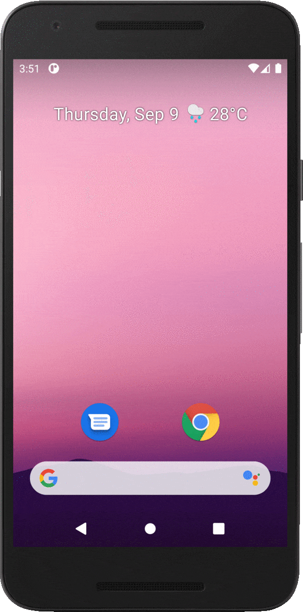
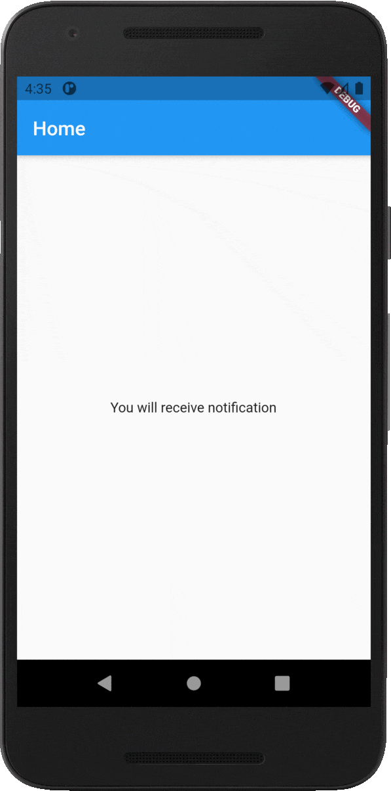

# Flutter FCM Push Notification

A Flutter sample app for demonstrating how to handle firebase push notifications in the background and foreground.

## Screenshots

Notification while the app is running in the **background** and handle navigation:



Notification while the app is running in the **foreground** and handle navigation:



## Plugins

The Flutter plugins used in this project are as follows:

- [cupertino_icons](https://pub.dev/packages/cupertino_icons)
- [firebase_core](https://pub.dev/packages/firebase_core)
- [firebase_messaging](https://pub.dev/packages/firebase_messaging)
- [firebase_analytics](https://pub.dev/packages/overlay_support)
- [flutter_local_notifications](https://pub.dev/packages/overlay_support)

Add the following to your `pubspec.yaml` file:

```yaml
  cupertino_icons: ^1.0.2
  firebase_messaging: ^10.0.4
  firebase_analytics: ^8.0.2
  flutter_local_notifications: ^8.1.1+1
  firebase_core: ^1.4.0
```
## Usage

In order to run this project, you have to follow the steps below:

1. Clone the project:

   ```bash
   git clone https://github.com/patoliavishal/flutter-FCM.git
   ```

2. Complete Firebase project setup for both **Android** & **iOS** platforms by going to the [Firebase console](https://console.firebase.google.com/).

3. For running on **iOS**, you have to do some configurations from Xcode. Follow the guide [here](https://firebase.flutter.dev/docs/messaging/apple-integration).

4. Get Flutter packages:

   ```bash
   flutter pub get
   ```

5. Run the app:

   ```bash
   flutter run
   ```

**If my example really helpful to you then please don't forgot to press **`Star`** icon.**


## Sent Notification Using Postman

   URL:
   ```bash
      https://fcm.googleapis.com/fcm/send
   ```

   Method:
   ```bash
      POST
   ```

   Header:
   ```bash
      "Content-Type": "application/json",
      "Authorization": "key=<Server_key>"
   ```

   Body:
   ```bash
      {
        "to": "/topics/flutter-notification",
        "notification": {
          "body": "Test Push Notification",
          "title": "Push Notification"
        },
        "data": {
          "title": "Push Notification",
          "message": "Test Push Notification",
          "redirect": "product"
        }
      }
   ```

Refer [http-server-ref](https://firebase.google.com/docs/cloud-messaging/http-server-ref) for more help.

# License
```license
Copyright (c) 2021 Vishal Patolia

Licensed under the Apache License, Version 2.0 (the "License");
you may not use this file except in compliance with the License.
You may obtain a copy of the License at

http://www.apache.org/licenses/LICENSE-2.0

Unless required by applicable law or agreed to in writing, software
distributed under the License is distributed on an "AS IS" BASIS,
WITHOUT WARRANTIES OR CONDITIONS OF ANY KIND, either express or implied.
See the License for the specific language governing permissions and
limitations under the License.
```

## Contributing to Flutter FCM Push Notification
1. Fork it
2. Create your feature branch (`git checkout -b my-new-feature`)
3. Commit your changes (`git commit -m 'Add some feature'`)
4. Push to the branch (`git push origin my-new-feature`)
5. **Create New Pull Request**
